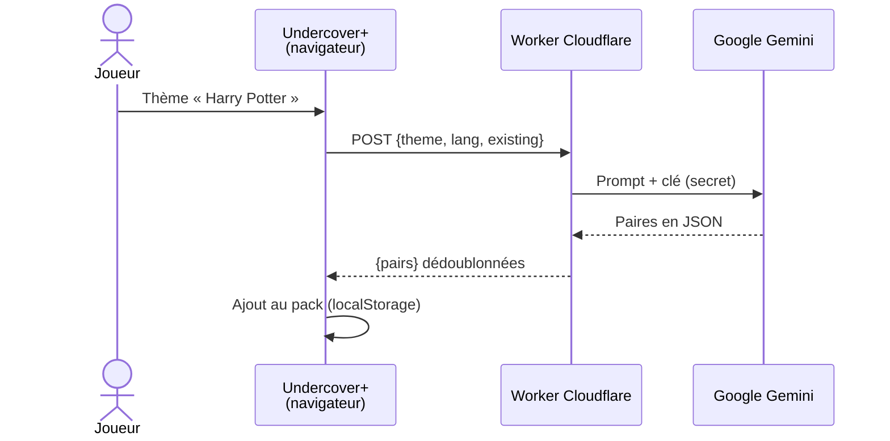

<div align="center">

# Undercover+

**Le jeu de soirée *Undercover* sur un seul téléphone, avec des paires de mots générées par IA sur n'importe quel thème.**
Gratuit · Sans inscription · Sans pub · Jouable hors-ligne · Bilingue FR/EN

### [▶ Jouer : timeojea.github.io/undercover-plus](https://timeojea.github.io/undercover-plus/)

[](https://github.com/timeojea/undercover-plus/actions/workflows/pages/pages-build-deployment)
[](LICENSE)


</div>

---

## 🎮 Règles du jeu

Un seul téléphone passe de main en main. Chaque joueur découvre son rôle en secret :

| Rôle | Reçoit |
|---|---|
| 🧑 **Civil** | Le mot secret commun (ex. *Chat*) |
| 🕵️ **Undercover** | Un mot proche mais différent (ex. *Tigre*) |
| 👻 **Mr. White** | Aucun mot : il doit bluffer |

À tour de rôle, chacun décrit son mot **en un seul mot**, puis le groupe vote pour éliminer un suspect.
Les Civils gagnent en éliminant tous les imposteurs ; les imposteurs gagnent dès qu'ils sont au moins aussi nombreux que les Civils encore en jeu.
Un Mr. White éliminé a une dernière chance : **deviner le mot des Civils** pour l'emporter.

## ✨ Fonctionnalités

| | |
|---|---|
| 🤖 **Mots par IA** | Tapez un thème (« Harry Potter », « Plage »…), Gemini génère 15 paires originales, sans doublon avec le pack |
| 📚 **Listes intégrées** | 3 packs officiels par langue : Nature & animaux, Sports & loisirs, Jeux vidéo (~50 paires en FR) |
| ✏️ **Éditeur de packs** | Créez, remplissez et supprimez vos propres packs de mots |
| 👥 **Joueurs sauvegardés** | Avatars auto (initiales colorées) ou photo, réimport d'une partie à l'autre |
| 🤫 **Révélation secrète** | Maintenir l'écran appuyé pour voir son rôle, relâcher pour le cacher |
| 🎲 **Tirage équitable** | Mot civil / undercover tiré au hasard dans la paire, Mr. White ne commence jamais |
| 🌍 **Bilingue** | Interface et mots en français ou en anglais, bascule instantanée |
| 📦 **PWA** | Installable sur l'écran d'accueil, jouable hors-ligne (hors génération IA) |

## ⚙️ Comment ça marche

Le jeu est **100 % statique** (HTML/CSS/JS vanilla, aucun framework, aucune étape de build) et tout tient dans le navigateur : joueurs, packs et lobby sont stockés en `localStorage`.

Seule la génération IA sort du téléphone. Elle passe par un petit **Worker Cloudflare** qui garde la clé Gemini et le prompt côté serveur : la clé n'est jamais exposée dans le front.



- Le Worker essaie `gemini-2.5-flash`, puis retombe sur `gemini-2.5-flash-lite` en cas de surcharge (503/429).
- Réponse en **mode JSON natif** (`responseSchema`) : pas de parsing fragile.
- Le service worker est **network-first** : en ligne on reçoit toujours la dernière version, le cache ne sert qu'hors-ligne.

## 🚀 Lancer en local

Aucune dépendance. Il suffit d'un serveur de fichiers statiques (le service worker ne fonctionne pas en `file://`) :

```bash
git clone https://github.com/timeojea/undercover-plus.git
cd undercover-plus
python -m http.server 8000
```

Ouvrir **[localhost:8000](http://localhost:8000)**. `npx serve` ou l'extension Live Server de VS Code marchent aussi.

Tout fonctionne sans configuration, y compris la génération IA, qui appelle le Worker public défini par `AI_ENDPOINT` en haut de [`script.js`](script.js).

## 🌍 Héberger votre propre copie

1. **Forkez** le dépôt.
2. **Settings → Pages → Source : Deploy from a branch**, branche `main`, dossier `/`.
3. **Déployez votre Worker IA** (compte Cloudflare gratuit + clé [Google AI Studio](https://aistudio.google.com/apikey) gratuite) :
   ```bash
   cd worker
   npx wrangler login
   npx wrangler secret put GEMINI_API_KEY
   npx wrangler deploy
   ```
   Détails : [`worker/README.md`](worker/README.md).
4. Remplacez `AI_ENDPOINT` dans [`script.js`](script.js) par l'URL de votre Worker.
5. Recommandé : renseignez `ALLOWED_ORIGIN` dans [`worker/wrangler.toml`](worker/wrangler.toml) avec votre domaine, puis redéployez.

## 🗂️ Structure

```
├── index.html                — Structure + toutes les modales
├── script.js                 — Logique de jeu, joueurs, packs, i18n, appel IA
├── data.js                   — Listes de mots intégrées (FR / EN)
├── style.css                 — Thème sombre, interface néon
├── sw.js                     — Service worker (network-first, hors-ligne)
├── manifest.json             — Manifest PWA
└── worker/
    ├── undercover-plus.js    — Proxy Gemini (clé, prompt, repli de modèle, dédoublonnage)
    └── wrangler.toml         — Config Cloudflare
```

Pour ajouter des listes permanentes, éditez l'objet `DATABASE` de [`data.js`](data.js) :

```javascript
const DATABASE = {
    "fr": {
        "Nature et animaux": [["Chat", "Tigre"], ...],
        // ...
    },
    "en": { /* ... */ }
};
```

## ⚠️ Limites connues

- **Génération IA en ligne uniquement**, et soumise au quota gratuit Gemini du Worker.
- **Données par appareil** : joueurs et packs vivent dans le `localStorage` du navigateur, sans synchronisation.
- **Listes anglaises plus courtes** que les françaises (24 à 39 paires contre ~50).
- La suppression d'un joueur sauvegardé est protégée par un code PIN (`4862`) écrit dans le code : il évite les fausses manipulations, ce n'est pas une sécurité.

## 🤝 Contribuer

Issues et pull requests bienvenues : [ouvrir une issue](https://github.com/timeojea/undercover-plus/issues). Gardez l'esprit du projet : vanilla, sans framework ni build.

Pistes ouvertes :
- prévisualiser les paires IA avant de les ajouter ;
- remplacer les `alert` / `confirm` / `prompt` par des modales ;
- suivi des scores entre les manches ;
- compléter les listes anglaises.

## 📄 Licence

[MIT](LICENSE) © Timéo Jeannin
