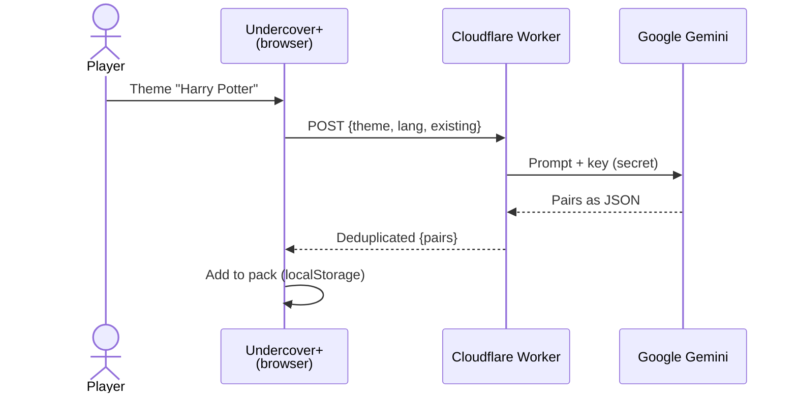

<div align="center">

# Undercover+

**The *Undercover* party game on a single phone, with AI-generated word pairs on any theme.**
Free · No sign-up · No ads · Works offline · English & French

### [▶ Play: timeojea.github.io/undercover-plus](https://timeojea.github.io/undercover-plus/)

[](https://github.com/timeojea/undercover-plus/actions/workflows/pages/pages-build-deployment)
[](LICENSE)


</div>

---

## 🎮 How to play

One phone is passed around. Each player secretly discovers their role:

| Role | Gets |
|---|---|
| 🧑 **Civilian** | The shared secret word (e.g. *Cat*) |
| 🕵️ **Undercover** | A close but different word (e.g. *Tiger*) |
| 👻 **Mr. White** | No word at all: has to bluff |

Taking turns, everyone describes their word **in a single word**, then the group votes to eliminate a suspect.
Civilians win by eliminating every impostor; impostors win as soon as they are at least as many as the remaining Civilians.
An eliminated Mr. White gets one last chance: **guess the Civilians' word** to win.

## ✨ Features

| | |
|---|---|
| 🤖 **AI word pairs** | Type a theme ("Harry Potter", "Beach"…), Gemini generates 15 original pairs, never duplicating the pack |
| 📚 **Built-in lists** | 3 official packs per language: Nature & Animals, Sports & Hobbies, Video Games (~50 pairs in French) |
| ✏️ **Pack editor** | Create, fill and delete your own word packs |
| 👥 **Saved players** | Auto avatars (colored initials) or a photo, re-import them game after game |
| 🤫 **Secret reveal** | Hold the screen to see your role, release to hide it |
| 🎲 **Fair draw** | Civilian / Undercover word picked at random within the pair, Mr. White never speaks first |
| 🌍 **Bilingual** | Interface and words in English or French, instant switch |
| 📦 **PWA** | Installable on the home screen, playable offline (except AI generation) |

## ⚙️ How it works

The game is **100% static** (vanilla HTML/CSS/JS, no framework, no build step) and lives entirely in the browser: players, packs and lobby are stored in `localStorage`.

Only AI generation leaves the phone. It goes through a small **Cloudflare Worker** that keeps the Gemini key and the prompt server-side: the key is never exposed in the front-end.



- The Worker tries `gemini-2.5-flash`, then falls back to `gemini-2.5-flash-lite` when overloaded (503/429).
- Responses use **native JSON mode** (`responseSchema`): no fragile parsing.
- The service worker is **network-first**: online you always get the latest version, the cache is only an offline fallback.

## 🚀 Run locally

No dependencies. All you need is a static file server (the service worker doesn't run on `file://`):

```bash
git clone https://github.com/timeojea/undercover-plus.git
cd undercover-plus
python -m http.server 8000
```

Open **[localhost:8000](http://localhost:8000)**. `npx serve` or VS Code's Live Server extension work too.

Everything works out of the box, AI generation included: it calls the public Worker set by `AI_ENDPOINT` at the top of [`script.js`](script.js).

## 🌍 Host your own copy

1. **Fork** the repository.
2. **Settings → Pages → Source: Deploy from a branch**, branch `main`, folder `/`.
3. **Deploy your own AI Worker** (free Cloudflare account + free [Google AI Studio](https://aistudio.google.com/apikey) key):
   ```bash
   cd worker
   npx wrangler login
   npx wrangler secret put GEMINI_API_KEY
   npx wrangler deploy
   ```
   Details: [`worker/README.md`](worker/README.md).
4. Set `AI_ENDPOINT` in [`script.js`](script.js) to your Worker's URL.
5. Recommended: set `ALLOWED_ORIGIN` in [`worker/wrangler.toml`](worker/wrangler.toml) to your domain, then redeploy.

## 🗂️ Project structure

```
├── index.html                — Markup + every modal
├── script.js                 — Game logic, players, packs, i18n, AI call
├── data.js                   — Built-in word lists (FR / EN)
├── style.css                 — Dark theme, neon UI
├── sw.js                     — Service worker (network-first, offline)
├── manifest.json             — PWA manifest
└── worker/
    ├── undercover-plus.js    — Gemini proxy (key, prompt, model fallback, deduplication)
    └── wrangler.toml         — Cloudflare config
```

To add permanent lists, edit the `DATABASE` object in [`data.js`](data.js):

```javascript
const DATABASE = {
    "en": {
        "Nature & Animals": [["Cat", "Tiger"], ...],
        // ...
    },
    "fr": { /* ... */ }
};
```

## ⚠️ Known limitations

- **AI generation needs a connection** and is bound by the Worker's Gemini free-tier quota.
- **Per-device data**: players and packs live in the browser's `localStorage`, with no sync.
- **English lists are shorter** than the French ones (24 to 39 pairs vs ~50).

## 🤝 Contributing

Issues and pull requests are welcome: [open an issue](https://github.com/timeojea/undercover-plus/issues). Keep the project's spirit: vanilla, no framework, no build step.

Open ideas:
- preview AI pairs before adding them;
- replace `alert` / `confirm` / `prompt` with modals;
- score tracking across rounds;
- longer English lists.

## 📄 License

[MIT](LICENSE) © Timéo Jeannin
